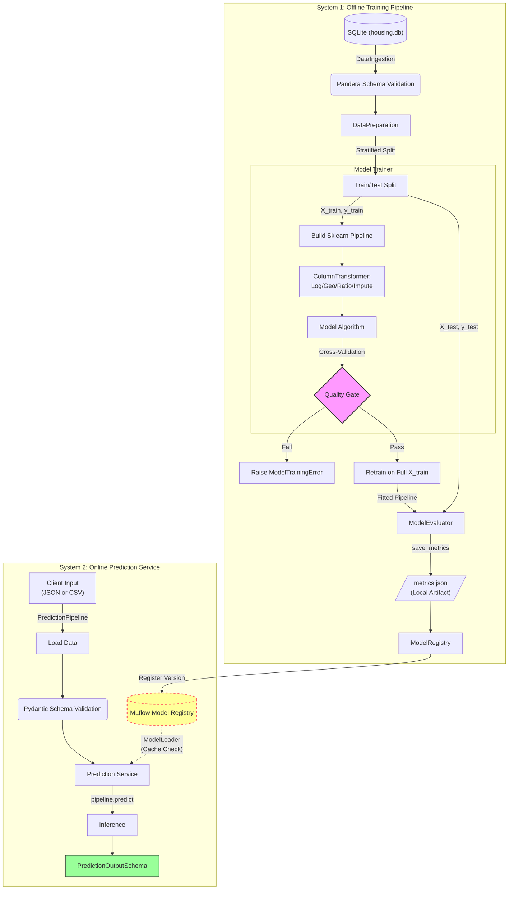

# California Housing Prediction Pipeline

### 1. Project Overview
This repository implements an end-to-end MLOps pipeline to predict median house values in California districts. Designed for reproducibility and scalability, the system leverages a modular component-based architecture, strict data contracts via **Pandera**, experiment tracking via **MLflow**, and configuration management via **Pydantic**.

The pipeline transforms raw census data into a production-ready predictive service, handling specific data challenges such as right-skewed distributions, multicollinearity, and geospatial clustering.

---

### 2. Folder Structure
The project adheres to the `src` layout pattern to ensure a clean separation between development tools, configuration, and production application logic.

```text
california-housing-mlops/
├── artifacts/              # Local storage for transient metrics (JSON) and models (PKL)
├── configs/
│   └── config.yaml         # Central "Source of Truth" for all pipeline parameters
├── data/
│   ├── raw/                # Immutable Source of Truth (Git-ignored to enforce DVC pattern)
│   │   └── housing.db
│   └── samples/            # Versioned test artifacts for inference validation (Committed)
│       └── sample_input.csv
├── notebooks/
│   └── eda.ipynb           # Exploratory Data Analysis & Preprocessing Blueprint
├── src/                    # Production-grade modular source code
│   └── california_housing/
│       ├── components/     # Standalone pipeline logic blocks
│       │   ├── data_ingestion.py   # Database extraction & schema validation
│       │   ├── data_preparation.py # Data cleaning & Stratified partitioning
│       │   ├── data_transformer.py # Scikit-Learn feature engineering factory
│       │   ├── model_trainer.py    # Training orchestration & CV logic
│       │   ├── model_evaluator.py  # Performance metrics & JSON persistence
│       │   ├── model_registry.py   # MLflow versioning & aliasing logic
│       │   └── model_predictor.py  # Inference service & schema enforcement
│       ├── core/           # System-level infrastructure (The "Engine Room")
│       │   ├── config.py            # Config discovery & loading logic
│       │   ├── config_definitions.py# Pydantic schemas (Strict type-safety)
│       │   ├── data_definitions.py  # Pandera schemas (The "Data Contract")
│       │   ├── exceptions.py        # Domain-specific custom error hierarchy
│       │   └── version.py           # Metadata for traceability & audit trails
│       ├── pipeline/       # Workflow orchestration (The "Conductors")
│       │   ├── training_pipeline.py # End-to-end Train-to-Registry workflow
│       │   └── prediction_pipeline.py# Batch/Request inference workflow
│       ├── models/         # Algorithm management
│       │   └── catalog.py           # Centralized algorithm mapping & factory
│       ├── utils/          # Shared functional utilities
│       │   ├── binning.py           # Custom math for stratified binning
│       │   └── model_naming.py      # MLflow registry naming conventions
│       └── main.py         # Unified CLI entry point (Click-based)
├── requirements.txt        # Deterministic dependencies for reproducibility
└── run.sh                  # Automation script 
```

---

### 3. Setup & Usage
#### 3.1 Prerequisites
* Python 3.12+
* Virtual Environment (Recommended)

#### 3.2 Installation
1. **Clone the repository:**
    ```bash
    git clone <repo_url>
    cd california-housing-mlops
    ```
2. **Install Dependencies:**
    ```bash
    pip install -r requirements.txt
    ```

#### 3.3 Executing the Pipeline
The `run.sh` script is the primary entry point. It wraps the CLI commands to ensure the `PYTHONPATH` is set correctly.

**1. Train Models:**
```bash
# Default: Train all models sequentially (LGBM, RF, XGB)
./run.sh
# Manual: Train specific architecture (e.g. LGBMRegressor)
./run.sh train LGBMRegressor
```

**2. Run Inference:**
```bash
# Run batch prediction on a CSV file
./run.sh predict --file data/samples/sample_input.csv
# Run prediction on a single JSON object
./run.sh predict --json '{"longitude": -122.23, "latitude": 37.88, "housing_median_age": 41, "total_rooms": 880, "total_bedrooms": 129, "population": 322, "households": 126, "median_income": 8.3252, "ocean_proximity": "NEAR BAY"}'
```

#### 3.4 Modifying Parameters
All pipeline behaviors are decoupled from the code to allow for experimentation without code changes. Edit `configs/config.yaml` to modify:
* **Hyperparameters:** Update the `params` section for any model (e.g., `n_estimators`, `learning_rate`).
* **Validation Strategy:** Toggle `validation_strategy` between `single_split` and `cross_validation`.
* **Feature Engineering:** Adjust `n_clusters` for geospatial analysis or add new `ratio_cols`.

---

### 4. Logical Flow & Architecture
The system uses **Dependency Injection** in `main.py` to assemble the pipeline. Data flows through a series of "Quality Gates" and "Transformers" before reaching the Model Registry.

#### 4.1 Pipeline Workflow


#### 4.2 Step-by-Step Flow Summary
1.  **Ingestion:** Extracts data from SQLite and enforces the initial Pandera data contract.
2.  **Preparation:** Cleans censored property values and performs a stratified train/test split.
3.  **Training:** Builds a custom Scikit-Learn pipeline, executes the validation strategy (CV or Split), and enforces the Quality Gate threshold.
4.  **Finalization:** Automatically retrains the winning architecture on the full training set (X_train + X_val) to maximize the signal.
5.  **Evaluation:** Conducts an unbiased assessment on the hold-out test set and persists results as JSON artifacts.
6.  **Registration:** Logs the model to MLflow and applies the `@staging` alias for deployment.
7.  **Inference:** Validates input via Pydantic, retrieves the cached model from the registry, and returns the prediction.

The entire flow is orchestrated via dependency injection in `main.py` with full MLflow telemetry and exception handling.

---

### 5. Key EDA Findings & Pipeline Choices
The feature engineering strategy was directly derived from insights gained during the Exploratory Data Analysis (EDA). Detailed EDA is in `eda.ipynb`; below is a quick summary.

#### 5.1 Key EDA Findings & Decisions
1. **Target Censorship:** ~5% of properties have a value capped at $500,001.
    * *Decision:* Applied a cleaning filter in `DataPreparation` to remove these rows to prevent the model from learning an artificial price ceiling.
2. **High Skewness:** Features like `median_income`, `population`, and `total_rooms` showed severe right-skew.
    * *Decision:* Implemented `np.log1p` transforms within the pipeline to normalize distributions for better linear convergence.
3. **Multicollinearity:** A 0.98 correlation was observed between `households` and `total_rooms`.
    * *Decision:* Engineered density ratios (e.g., rooms_per_household) from raw counts to explicitly surface high-signal feature interactions for the model.
4. **Geospatial Hotspots:** Latitude/Longitude plotted against price showed distinct non-linear clusters (e.g., Bay Area, LA).
    * *Decision:* Implemented a custom `ClusterSimilarity` transformer using K-Means to generate distance features to economic centers.

#### 5.2 Feature Processing Summary
| Feature(s) | Characteristic | Strategy | Scikit-Learn Tool | Justification |
| :--- | :--- | :--- | :--- | :--- |
| `median_income`, `total_rooms`, `population`, `households` | Right-skewed; outliers. | 1. Median Impute<br>2. Log Transform<br>3. Standard Scale | `SimpleImputer`<br>`FunctionTransformer`<br>`StandardScaler` | Log transform (np.log1p) compresses the long tail, reducing outlier impact and improving normality for linear convergence. |
| `housing_median_age` | Capped at 52; symmetric. | 1. Median Impute<br>2. Standard Scale | `SimpleImputer`<br>`StandardScaler` | Feature is bounded and relatively normal; standard scaling is sufficient. |
| `bedroom_ratio`, `rooms_per_house`, `people_per_house` | High multicollinearity. | 1. Impute (Input)<br>2. Ratio Calculation<br>3. Impute (Result)<br>4. Standard Scale | `SimpleImputer`<br>`RatioFeature`<br>`StandardScaler` | **Double Imputation** prevents division-by-zero errors. Ratios reduce multicollinearity by capturing density signals. |
| `latitude`, `longitude` | Strong geographic interaction. | 1. Median Impute<br>2. Standard Scale<br>3. K-Means Clustering<br>4. RBF Similarity | `ClusterSimilarity` | Captures non-linear proximity to high-value economic hubs (e.g., SF/LA) identified during EDA. |
| `ocean_proximity` | Low cardinality; rare 'ISLAND' category. | 1. Merge Rare Categories<br>2. Mode Impute<br>3. One-Hot Encode | `CategoryMerger`<br>`SimpleImputer`<br>`OneHotEncoder` | Merges the rare 'ISLAND' category into 'NEAR OCEAN' to prevent overfitting, then applies OHE. |

#### 5.3 Final Sanitation Layer
Following feature engineering, a global **Sanitation Layer** protects the model from technical artifacts and ensures 100% compatibility with boosting frameworks:

*   **Feature Name Sanitization:** Enforces `snake_case` patterns to prevent XGBoost/LightGBM crashes caused by special characters (e.g., `[`, `<`, `]`) often generated by Scikit-Learn.
*   **Infinity Remediation:** Translates "illegal math" (Infinities from division-by-zero or log-of-zero) into "missing data" (NaNs) to ensure mathematical stability.
*   **"Safety Net" Imputation:** A terminal `SimpleImputer` fills any missing values generated during the transformation phase, providing a complete and finite feature matrix to the estimator.
---

### 6. Model Selection & Evaluation
#### 6.1 Choice of Models
The pipeline is engineered to evaluate three distinct algorithmic families. This multi-model approach ensures that the system can establish a robust baseline and remain competitive through periodic retraining as the underlying housing data evolves:

*   **Random Forest (Bagging Baseline):** Included to establish a performance floor. Its ensemble averaging provides high stability and resistance to outliers without requiring complex tuning.
*   **LightGBM (Leaf-wise Boosting Candidate):** Included for its aggressive optimization capabilities. Its leaf-wise growth strategy is specifically designed to explore deep, non-linear interactions within geospatial data at high speeds.
*   **XGBoost (Level-wise Boosting Benchmark):** Included as the high-precision candidate. Its level-wise growth and strict regularization offer a balanced approach to boosting, serving as the primary benchmark for predictive accuracy.


#### 6.2 Evaluation Metrics
The metrics are organized in a hierarchy: **Primary** for core decisions/gating, **Secondary** for interpretability and model fit, and **Diagnostic** for internal analysis/optimization. All are computed on validation and test sets.

* **RMSE (Root Mean Squared Error) - Primary:** The core metric for the **Quality Gate**. RMSE squares errors to penalize large deviations heavily. In real estate, underestimating a high-value property by a wide margin poses significant financial risk, making RMSE ideal for absolute error assessment in dollars.
* **MAE (Mean Absolute Error) - Secondary:** Provides stakeholder-friendly interpretability as the "average dollar miss" per prediction, offering a straightforward view of typical error without squaring's emphasis on outliers.
* **R² (Coefficient of Determination) - Secondary:** Measures the proportion of variance in house values explained by the model (range: 0-1). Tracked to evaluate overall fit and how well features capture underlying price drivers.
* **MSE (Mean Squared Error) - Diagnostic:** The unsquared precursor to RMSE (Units: $\text{Dollars}^2$). While less interpretable for stakeholders, it is logged to maintain unit parity with the model's internal objective function (L2 Loss). This allows for a direct mathematical comparison between the terminal training loss and the validation error to quantify the Generalization Gap (overfitting) without the non-linear "dampening" effect of a square-root transformation.

#### 6.3 Performance Results
*Note: Results are evaluated on the 20% holdout test set (3,935 records).*

| Model | RMSE (Test) | MAE (Test) | R² (Test) | Status |
| :--- | :--- | :--- | :--- | :--- |
| **XGBoost** | **37,917** | **24,995** | **0.8448** | **Champion** |
| LightGBM | 38,187 | 25,531 | 0.8425 | Candidate |
| Random Forest | 38,392 | 25,421 | 0.8408 | Benchmark |


**Evaluation Conclusion:**
**XGBoost** has been promoted to the **Production Champion** based on its superior ability to capture the complex geospatial and economic signals of the California housing market. The selection is based on the following architectural strengths:

1.  **Maximum Predictive Signal:** XGBoost achieved the highest precision across all metrics, successfully explaining **84.48% of the price variance**. It consistently delivered the lowest average "dollar-miss" (MAE), making it the most financially reliable model for stakeholders.
2.  **Architectural Stability:** The level-wise growth pattern of XGBoost provides a more balanced tree structure compared to leaf-wise alternatives. This architectural "symmetry" results in a more stable model that is less prone to over-indexing on localized noise or censored data points.
3.  **Generalization Reliability:** The model has the least difference between training performance and unseen test performance. This indicates that the champion has learned fundamental market drivers that will remain robust when deployed to live production data.
4.  **Operational Excellence:** XGBoost offers an optimal trade-off between model complexity and inference speed. It provides predictable P99 latencies, ensuring the prediction service remains highly responsive under batch or real-time workloads.

---

### 7. Key Engineering Design Patterns
This pipeline follows an **"MLOps-First"** philosophy, moving beyond experimental scripts to a production-grade system. The architecture prioritizes reliability, observability, and defensive programming to ensure the model is safe for deployment.

*   **Fail-Fast Configuration Validation:** The system utilizes strict **Pydantic** schemas (`ConfigSchema`) to validate `config.yaml` at the moment of entry. By using `extra="forbid"` and custom `@model_validator` logic, we prevent the pipeline from executing under ambiguous or incorrect parameters, saving compute time and preventing silent downstream failures.

*   **Strong Data Contracts (Inbound):** **Pandera** `HousingSchema` is enforced at the ingestion layer. This acts as a physical "Inlet Gate," validating column types, null-constraints, and value ranges (e.g., latitude/longitude bounds) before data reaches the transformers. This is the primary defense against data drift and schema corruption.

*   **Training-Serving Parity:** The system eliminates "Training-Serving Skew" by serializing the entire Scikit-Learn `Pipeline` artifact (inclusive of the `DataTransformer` factory). This ensures that the exact same feature engineering logic (K-Means clusters, ratios, and log-transforms) is applied identically to both training data and real-time inference requests.

*   **Bias-Aware Stratified Sampling:** To mitigate sampling bias, the pipeline implements a rigorous stratified split on `median_income`. The implementation includes multiple **safety gates** (minimum samples per bin and NaN protection) to ensure the test set is a statistically representative mirror of the California housing population.

*   **Full-Signal Retraining:** After a model architecture passes the Quality Gate during cross-validation, the system automatically **retrains the estimator on the full training partition** (X_train + X_val). This ensures the final production artifact captures the maximum available signal before registration.

*   **Automated Quality Gates:** Promotion to the Model Registry is not guaranteed. The `ModelTrainer` enforces a hard **Quality Gate**; if the validation RMSE exceeds the `quality_threshold` defined in the config, the pipeline intentionally aborts. This prevents sub-standard or "broken" models from ever being registered.

*   **Leakage-Free Feature Engineering:** Custom Scikit-Learn transformers (e.g., `ClusterSimilarity` with target-weighted KMeans) are orchestrated via a centralized factory. All stateful transformations are **fitted exclusively on training data** and stored within a unified pipeline object, ensuring total parity between training and inference while strictly preventing data leakage.

*   **Defensive Post-Processing (Sanitation Layer):** The pipeline includes a global "Sanitation Layer" (`inf_to_nan`, `FeatureNameSanitizer`, and `final_imputer`). This ensures that regardless of the complexity of upstream engineering, the final data passed to the estimator is clean, finite, and compatible with model-specific naming constraints.

*   **Standardized Model Registry & Lineage:** The pipeline implements a formal registration step using **MLflow**. Every model architecture that passes the internal **Quality Gate** is automatically versioned and stored in the registry. This ensures full **Auditability and Lineage**; the team can track the historical performance of every candidate architecture (XGB, LGBM, RF) over time, while using **MLflow Aliases** (`@staging`) to point the inference service to the specific artifact intended for deployment.

*   **Thread-Safe Inference & Caching:** The prediction service utilizes a **Singleton ModelLoader** with in-memory caching and a `threading.Lock()`. This ensures that in a high-concurrency production environment, the heavy model artifact is loaded into memory only once and shared safely across threads, delivering low-latency, high-throughput predictions.

*   **Error Taxonomy & Observability:** The system implements a custom exception hierarchy (`IngestionError`, `ModelTrainingError`, etc.). These are mapped to **Rich MLflow Tags** (e.g., `failure_category`, `failure_step`), making every pipeline failure instantly diagnosable via the MLflow UI without digging through raw logs.

*   **Safe Automation Logic:** The `run.sh` entry point enforces **Bash Strict Mode** (`set -euo pipefail`). This ensures that any sub-process failure (CLI or Python) immediately halts the entire automation chain, preventing cascading errors in automated environments.

---

### 8. Future Improvements
While the current system provides a robust foundation for California Housing predictions, the following enhancements represent the "Product Roadmap" for a full-scale deployment:

* **Structured JSON Logging:** Enable for cloud deployments to support log aggregation in CloudWatch/Datadog and query-based debugging. Current text logs are perfect for local development but insufficient for distributed systems.

* **End-to-End Integration Tests:** Add full pipeline tests (ingest → train → evaluate → register → predict) to CI/CD to catch regressions before deployment.

* **Automated Champion Promotion (Tournament Pattern):** Introduce a decoupled **Promotion Service** that acts as a "Tournament Orchestrator."  
  * **Current implementation:** Every model that passes the Quality Gate is automatically registered and aliased to `@staging` (for development visibility and auditability).  
  * **Future enhancement:** After each training cycle, the orchestrator first selects the best candidate from the current run and promotes it to `@staging` (the new Challenger). It then compares this challenger against the current `@champion` and promotes it to `@champion` **only if** it demonstrates a statistically significant improvement (e.g., >2% reduction in test RMSE). This ensures the serving layer is updated only when a genuine performance gain is verified.